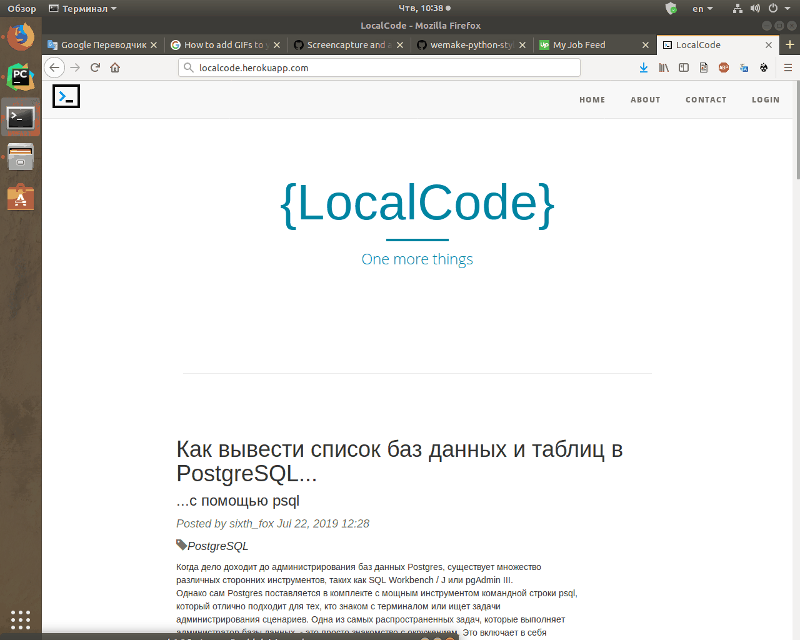

# Web_note
web application for {{ you }} notes

# Install
Clone repo
```bash
git clone https://github.com/sixth-fox/web_note.git
```
Install requirements
```bash
pip install -r requirements.txt
```
Run
```bash
python manage.py runserver
```
# Presentation

